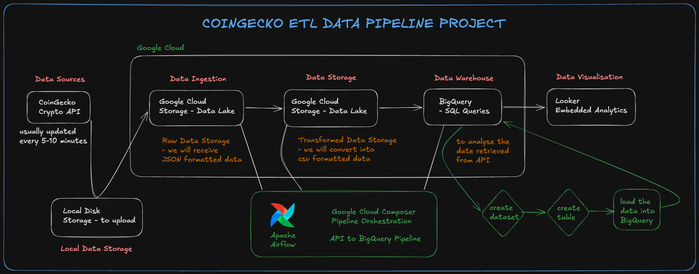
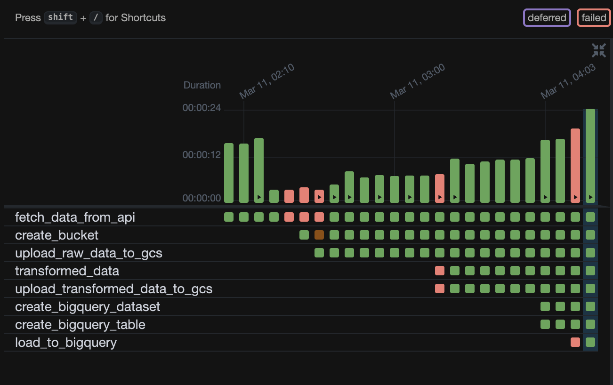
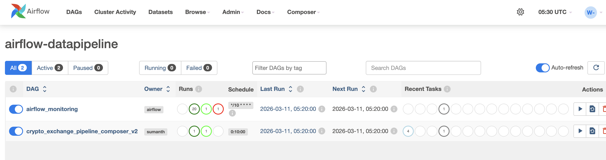
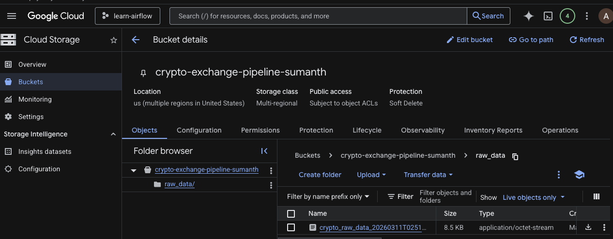
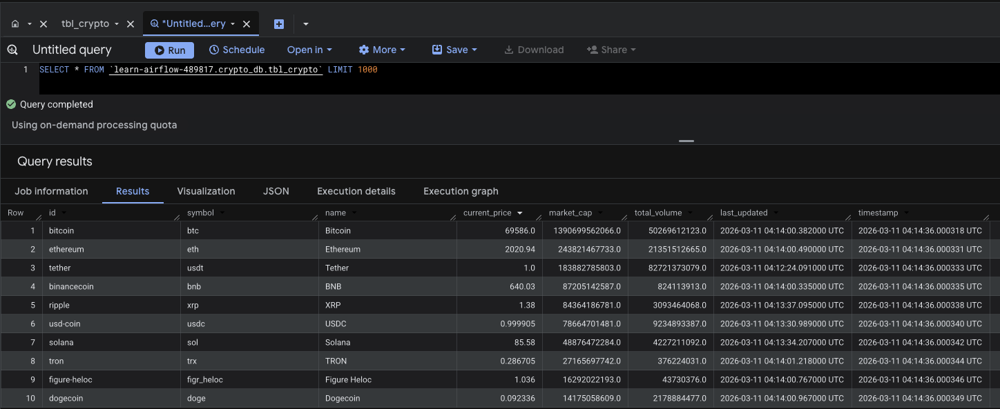
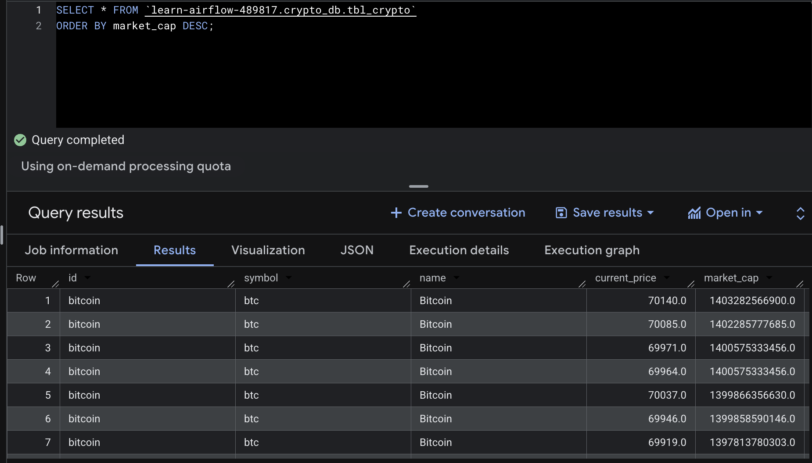
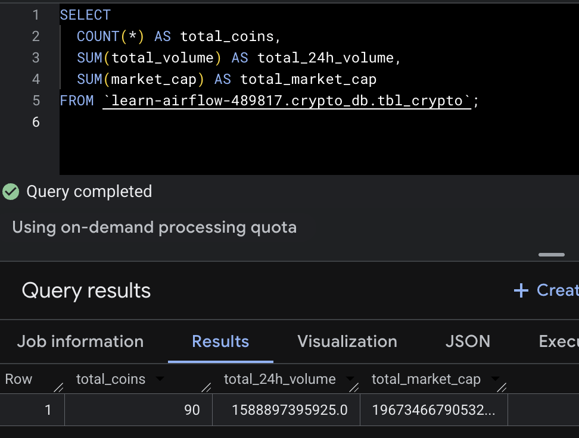

# Crypto Data Pipeline

ETL pipeline that fetches cryptocurrency market data from the CoinGecko API, transforms it, stores it in Google Cloud Storage (GCS), and loads it into BigQuery — orchestrated by Apache Airflow.

## Architecture



```
CoinGecko API → Airflow → Google Cloud Storage → BigQuery
```

### Pipeline Flow (Composer v2 — Production)
```
fetch_and_upload_raw → transform_and_upload → create_bq_dataset → create_bq_table → load_to_bigquery
```

1. **Fetch & Upload Raw** — Fetch top 10 crypto market data from CoinGecko API and upload raw JSON directly to GCS
2. **Transform & Upload** — Download raw JSON from GCS, transform to structured CSV, upload back to GCS
3. **Create BigQuery Dataset** — Create `crypto_db` dataset if not exists
4. **Create BigQuery Table** — Create `tbl_crypto` table if not exists
5. **Load to BigQuery** — Load transformed CSV from GCS into BigQuery

### GCS Bucket Layout
```
crypto-exchange-pipeline-sumanth/
├── raw_data/
│   └── crypto_raw_data_<timestamp>.json
└── transformed_data/
    └── crypto_transformed_data_<timestamp>.csv
```

### BigQuery Schema
| Column | Type | Description |
|--------|------|-------------|
| id | STRING | Coin identifier (e.g., bitcoin) |
| symbol | STRING | Ticker symbol (e.g., btc) |
| name | STRING | Full name (e.g., Bitcoin) |
| current_price | FLOAT | Current USD price |
| market_cap | FLOAT | Market capitalization |
| total_volume | FLOAT | 24h trading volume |
| last_updated | TIMESTAMP | Last update from CoinGecko |
| timestamp | TIMESTAMP | Pipeline extraction time |

## Tech Stack
- **Apache Airflow 2.10.5** — orchestration
- **Docker Compose** — local infrastructure (PostgreSQL, Redis, CeleryExecutor)
- **Google Cloud Composer** — managed Airflow on GKE
- **Google Cloud Storage** — data lake
- **Google BigQuery** — data warehouse
- **CoinGecko API** — crypto market data (free tier)
- **pandas** — data transformation

## DAG Files

| File | Purpose | Environment |
|------|---------|-------------|
| `crypto_exchange_pipeline.py` | Full 8-task pipeline with local `/tmp/` file sharing | Local Docker |
| `crypto_exchange_pipeline_composer_v2.py` | Uses GCSHook for all data transfer, no `/tmp/` dependency | Composer (working) |
| `archive/crypto_exchange_pipeline_composer_v1.py` | First Composer attempt — used `/tmp/` which doesn't work on K8s | Archived |

## Getting Started (Local)

1. Clone the repo:
   ```bash
   git clone https://github.com/sumanthmalipeddi/coingecko-etl-pipeline.git
   cd coingecko-etl-pipeline
   ```

2. Copy env file and configure:
   ```bash
   cp .env.example .env
   ```

3. Add your GCP service account key to `config/` directory

4. Build and start:
   ```bash
   docker-compose build
   docker-compose up -d
   ```

5. Open http://localhost:8080 (login: `airflow` / `airflow`)

6. Set up Google Cloud connection in Airflow UI:
   - Go to **Admin → Connections**
   - **Connection Id**: `google_cloud_default`
   - **Connection Type**: Google Cloud
   - **Keyfile Path**: `/opt/airflow/config/<your-key-file>.json`

7. Unpause `crypto_exchange_pipeline` DAG

## Deploying to Google Cloud Composer

1. Create a Composer environment (Airflow 2.10.5)

2. Upload the Composer-compatible DAG:
   ```bash
   gcloud composer environments storage dags import \
     --environment=<ENV_NAME> \
     --location=<REGION> \
     --source=dags/crypto_exchange_pipeline_composer_v2.py
   ```

3. The DAG uses the default `google_cloud_default` connection which is pre-configured in Composer

## Screenshots

### Local Airflow — 8 Task Pipeline


### Composer DAG


### Gantt Chart & Graph View


### GCS Bucket


### BigQuery Query Results




## Key Learnings

- **Local vs Composer**: Local Airflow uses Docker with shared `/tmp/` volume. Composer runs tasks in separate Kubernetes pods — `/tmp/` is not shared between tasks.
- **Solution**: Use `GCSHook` to upload/download data directly within Python tasks instead of writing to local filesystem.
- **XCom**: Used to pass GCS file paths between tasks (small metadata only).
- **BigQuery table creation**: `BigQueryCreateEmptyTableOperator` may not be available in all Composer versions — use `BigQueryInsertJobOperator` with `CREATE TABLE IF NOT EXISTS` SQL instead.
- **Catchup**: Set `catchup=False` and `start_date` close to current time to prevent backfill runs.
